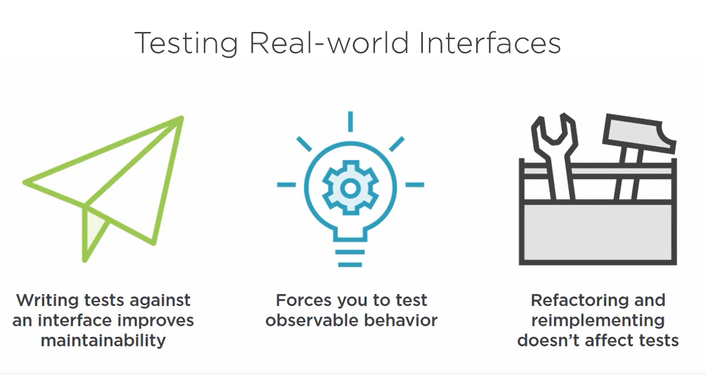
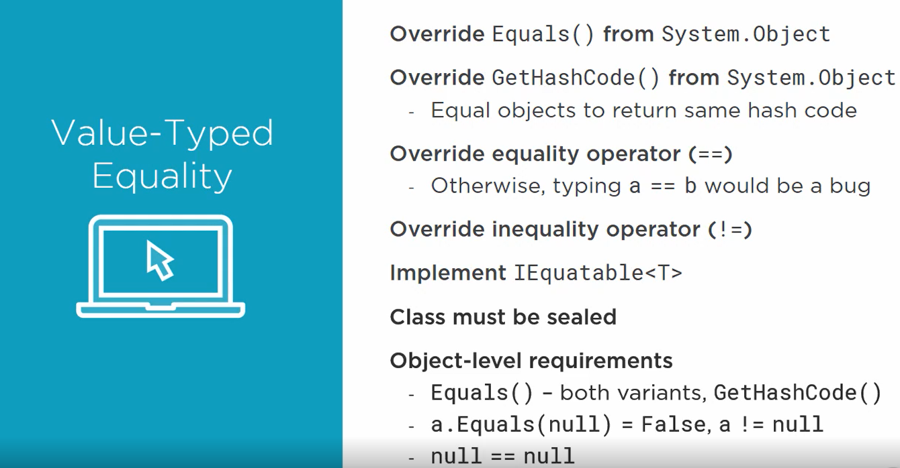
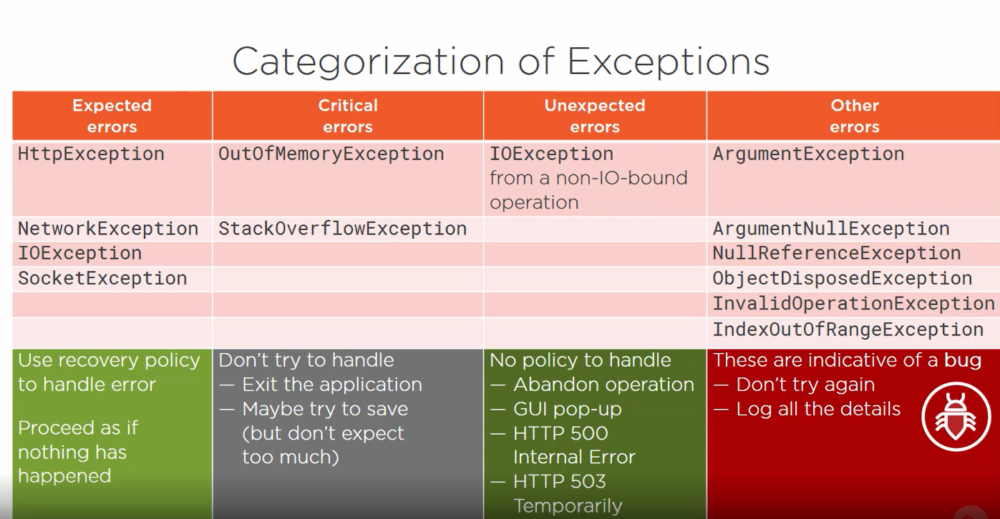
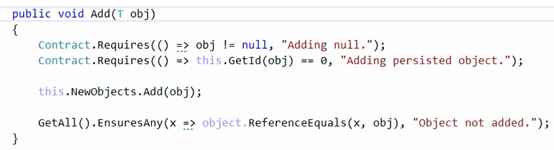
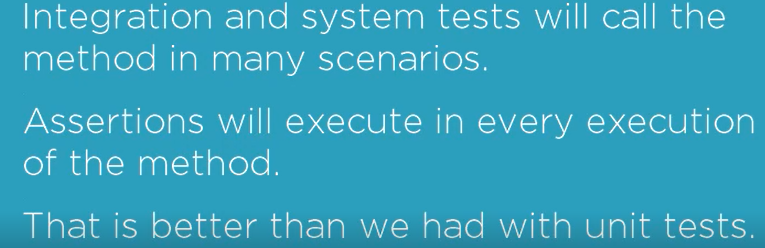

# Unit Testing summary

- point of out focus in test,(Automated tests)

- one single claim for one pease of code.

- Remove everything to just have a unit

## how to write a maintainable tests?

### Notes

- Maintainability is so important
- poor design dependencies leeds to poor tests
- implementation testing (white box testing)
- ADT(abstract data types)
- Design of the test is more important than technologies
- choose example wisely then we can relay on tests but not completely 😉
- most power is with formal logic and we take advantage with using test sets

Your function should be always logically true then its testable.
obj is  never null in production code, We hate null reference exception 😁 .
boundaries testing is important ex: two same array with different index positions
    - the problem with manual testing is a long process and any change to the code will force us to do the manual testing again.
    - Tests are different from production

## how to build a test?

1. state test (after method exit check the object)
2. interaction test (while execution of the method check method used properly)
3. if all test fails with exception that means we probably missing wrong test
4. Test failing with exception is inconclusive(bi natije)
5. for maintainability expose the smaller states of object
6. classes are better to be testable

## StarNote: Claims that we are asserting should be relevant (Multi assert just with explicit claims)

### No information should be lost if one assertion will fail if we keep our assert distinct

### its important that test fail clean, not ugly then we can say it's conclusive

### We have to take care of False negative which means it's passed but its not that what we wanted

### State test checks the assertion made against state variables

### Test design affect -> Code design (unit tests are clients to production code)

## Interactive tests notes

its good to have a `Test double` which is a fake object with same functionalities of our object but its just for testing and may have additional properties and methods or overrides default behavior which help us during the assertion.
using interface gives us better `Test doubles` -also we can use mocking frameworks

### StarNote: Passing test means the production code is working in the way is coded inside the test

- failing test after code modification is called regression
- False Positive Test is the test which is failing but there is no defect(fault)
- interaction tests should just test interaction not implementation

## The Role of the Tests

### - Not assume any implementation

### - Verify effects of an operation

### - Not stand in the way of changing the implementation

### Note

- keep in mind which mocking method will bring us benefits.
- False Negative Code will pass but its wrong
- we have to be careful with Isolation frameworks
- Tests with Isolation usually fails after changes and we may have false positive
- its better to use abstract member instead of virtual to force implementation they are safer
- Stubs -> remove hard dependencies
- State testing help us to catch the bug of course if there is any bug 😁

## Dependencies

- We call data dependencies stub (serves canned answers to the system under the test)
- Mock (Simulate behavior of real object and allows verifications)
- We don't wan mock and stub as a same object also multiple mock is also a bad idea because we may use them for the assertion.
- Mock is for interaction and stubs have less responsibilities
- Mock should return simplest value if required
- Test dummies are the object which do nothing but make tests compile.
- No  over specification in tests
- If life time of object is important the class that uses that of object have to consider the life time of that as well (IDisposable implantation).

## ⚠💀 Assert something did not happen is probably too defensive and keep in mind there are so many thing that do not happen -> useless tests

### Hints

- sometimes is good to skip some tests during refactoring and after refactoring make them pass and each test framework providing some functionality to skip.
- best practice is to skip with note include for example reimplement after task #23
- Never ever Mark tests as Temporary, Commented, TODO,ets. either we should need a test or shouldn't.
- It not so useful to have tests with `Negative requirements` which means something bad is not happening.
- Assert that expected behavior did happen
- All required changes must truly happen under the test
- Natural rules against unexpected behavior
- Temporal coupling Call 1 must precede call 2 or otherwise execution will not be correct
- constrain on execution order is also a good idea regarding to our case
  
## Abstract data types

- ADTs can be interfaces
- Rules of of the ADT can be represent as logical implications
- We cant test whether a concrete type satisfies rules of its ADT
- ADT Must always be true
- Tests that ASsert behavior are easier to maintain
- Assert Against ADT give us Highest standard behavior
- `class invariant` is condition must be true all time. ex: count of list with no member is zero
- Avoid loops in unit tests in general
- Tests which satisfy ADTs its working for all the implementations of those ADTs
- ADTs not covering non-functional requirements and we will need tests which will covering implementation not contract
- `Black box testing` writing unit tests against a public interface (ADT) -> easier to maintain
- `White box testing` writing unit tests against concrete class (Branch coverage technique)
- Failing test can tell us we are missing a requirement
- Writing tests which throws exception is good when about your constrains for example outOfRangeException or in general the situation that or sut can not handle
- when we have a guard cause that means if satisfied that case our method is undefined

## Test Against Interface

- we have to be carefully with inheritance drive from abstract class is more flexibility in testing
- 
- ADT & LSP are best friends

## TDD

Good inheritance testing choices are generic classes and interfaces, cover unit tests which they are missing before adding the feature. Point of interfaces is to capture universal data types.
the idea is write a good failing test and with minimal implantation make that pass.
if you have some finding in your code first try to write a unit test for that.

### Idea

- we should be able to refactor the code covered by the test but its possible only we cover the behavior and implantation tests may fail.
- We some class are affecting behavior of the other class by testing the affected class we covered that class as well.
- 
- Tests don't deal with implementations

## Testing Design Patterns

- We have to consider separation of concern
- We can treat value types as simple value
- Top-Down Coding Style
  1. Start by designing the calls from the consuming end as you wish them to be.
  2. Then provide detailed implementation to satisfy the desired interface.
- To check equality in data types its good to override Equals and GetHash code this way two equal object should return same hashCode we can also override equality sign and != which check equality by reference and important is to implement Iequitable to avoid casting
- 
- Some times we need our in house libraries to unit test some requirements

## Design by contracts

- Always caller validate the condition
- 
- It's good to design by contract and have some preconditions
- when we sure about state of our object there is nothing to worry about
- Liskov law is a life saver and violating that going to problematic
- 
- Preconditions must be satisfy before method executions begins
- Contracts are runtime unit tests 😊Proper preconditions and post conditions will save us for writing unit tests because those test already covered by conditions
- 
- 
- Contracts are good for debug code not production code we can make contract classes by debug attribute which make them just build in debug
